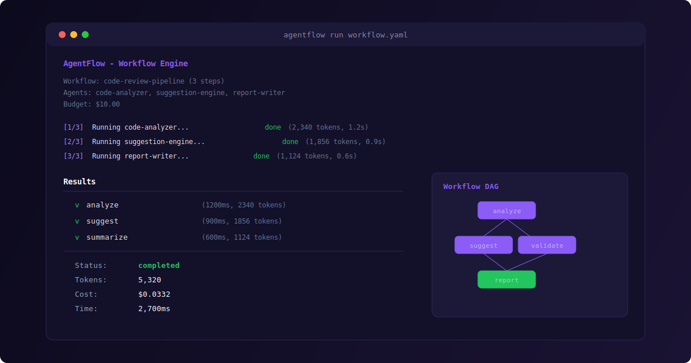
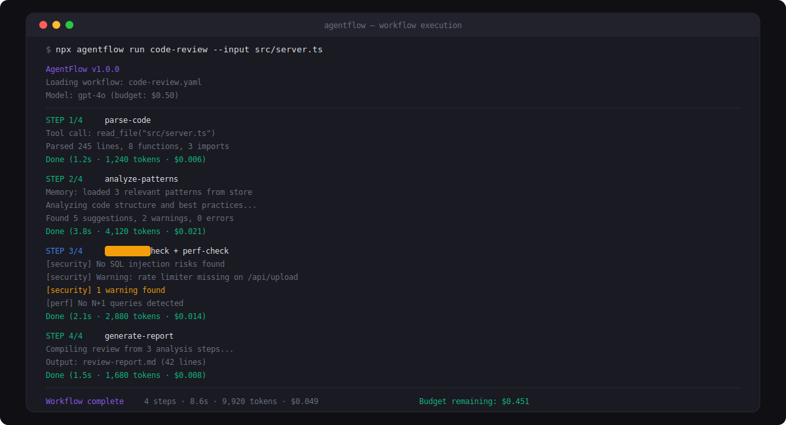
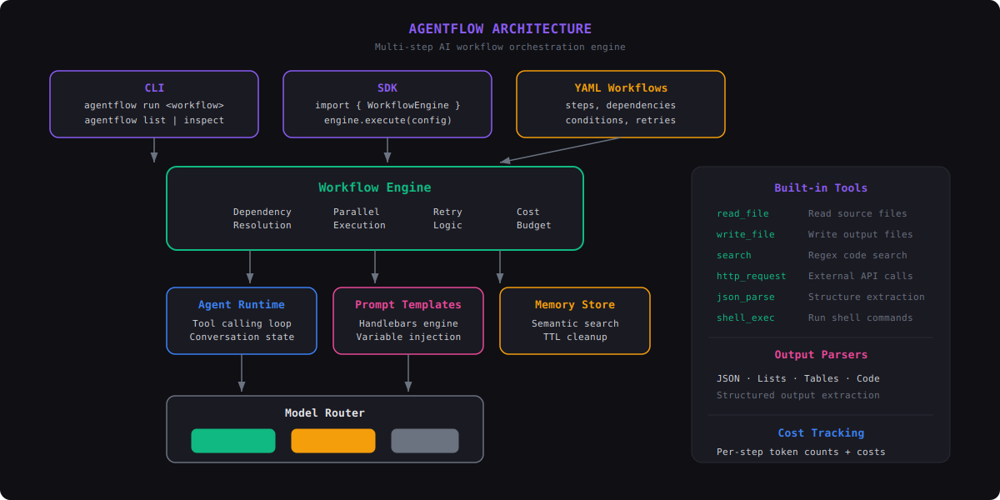

# AgentFlow

AI agent workflow orchestration engine with multi-model support, tool calling, and cost tracking.



### Workflow Execution


### Architecture


## Features

- **Workflow Engine** — Define multi-step AI workflows with YAML or TypeScript
- **Multi-Model Support** — Route between OpenAI and Anthropic models seamlessly
- **Tool Calling** — Define custom tools with typed parameters and validation
- **Memory System** — Short-term conversation buffer with semantic search
- **Prompt Templates** — Handlebars-based templates with variable injection
- **Output Parsing** — Extract JSON, lists, tables, and code blocks from LLM output
- **Cost Tracking** — Token counting and budget limits per workflow
- **Retry Logic** — Configurable retries with exponential backoff and model fallback
- **CLI** — Run workflows, list agents, inspect execution history
- **Parallel Execution** — Steps with resolved dependencies run concurrently

## Quick Start

```bash
npm install agentflow

# Set API keys
export OPENAI_API_KEY=sk-...
export ANTHROPIC_API_KEY=sk-ant-...

# Run a workflow
npx agentflow run examples/code-review.yaml
```

## SDK Usage

```typescript
import { WorkflowEngine, Agent, Tool } from "agentflow";

const engine = new WorkflowEngine(5.0); // $5 budget

const reviewer = new Agent({
  name: "reviewer",
  model: "gpt-4o",
  provider: "openai",
  systemPrompt: "You are a senior code reviewer.",
  description: "Reviews code for quality and correctness",
});

engine.registerAgent("reviewer", reviewer);

const result = await engine.execute({
  name: "review",
  description: "Code review workflow",
  version: "1.0",
  steps: [
    { id: "review", agent: "reviewer", input: "Review this code: ..." },
  ],
});

console.log(result.totalCostUsd);
```

## Workflow Definition

```yaml
name: my-workflow
steps:
  - id: step-1
    agent: analyzer
    input: "Analyze this data..."
    outputKey: analysis

  - id: step-2
    agent: writer
    input: "Summarize: {{analysis}}"
    dependsOn: [step-1]
    retries: 3
```

## Project Structure

```
src/
├── core/
│   ├── engine.ts      # Workflow orchestration
│   ├── agent.ts       # Agent runtime
│   ├── tool.ts        # Tool definition & validation
│   ├── prompt.ts      # Template engine
│   └── cost.ts        # Token & cost tracking
├── models/
│   └── router.ts      # Multi-provider model routing
├── memory/
│   └── store.ts       # Memory system
├── utils/
│   ├── logger.ts      # Structured logging
│   └── parser.ts      # Output parsing
├── cli/
│   ├── index.ts       # CLI entry point
│   └── commands/      # CLI commands
├── types.ts           # Type definitions
└── index.ts           # SDK exports
```

## License

MIT

## Supported Providers

- OpenAI (GPT-4, GPT-3.5)
- Anthropic (Claude 3)
- Local models via Ollama

---

## 🇫🇷 Documentation en français

### Description
AgentFlow est un moteur d'orchestration de workflows pour agents IA avec support multi-modèles, appel d'outils et suivi des coûts. Il permet de concevoir, exécuter et monitorer des pipelines d'agents IA complexes avec une interface visuelle intuitive. Compatible avec OpenAI, Anthropic et d'autres fournisseurs de modèles.

### Installation
```bash
npm install agentflow
```

### Utilisation
```bash
# Configurez vos clés API
export OPENAI_API_KEY=sk-...
# Puis définissez et exécutez vos workflows d'agents
```
Consultez la documentation en anglais ci-dessus pour la création de workflows, la gestion des outils et le suivi des coûts.
